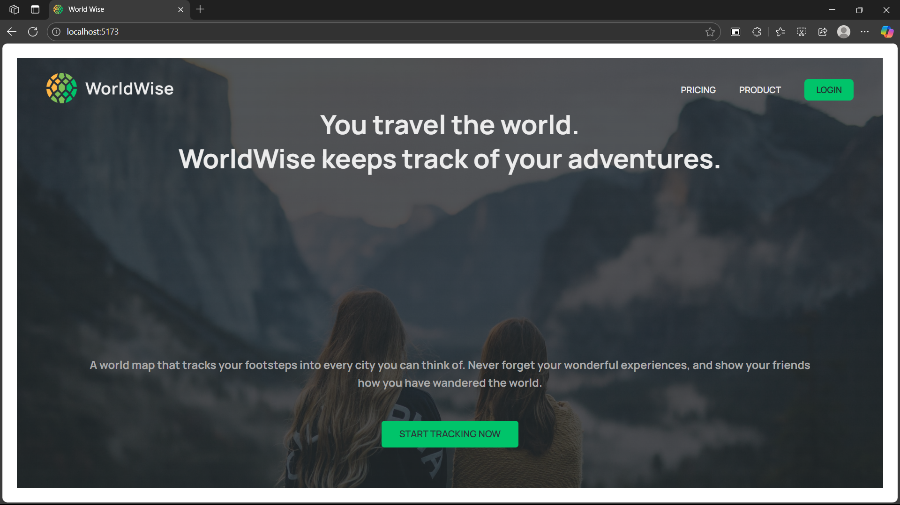
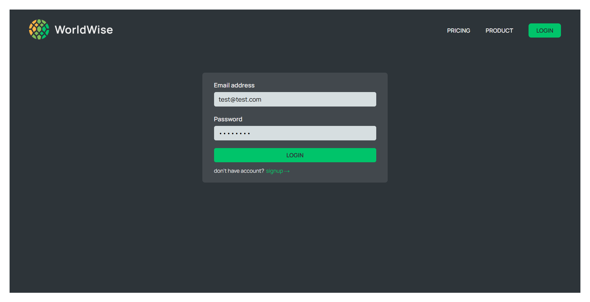
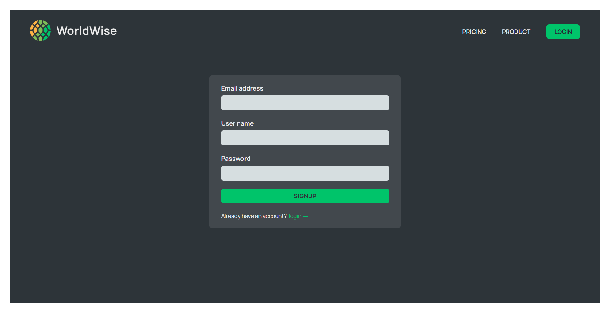
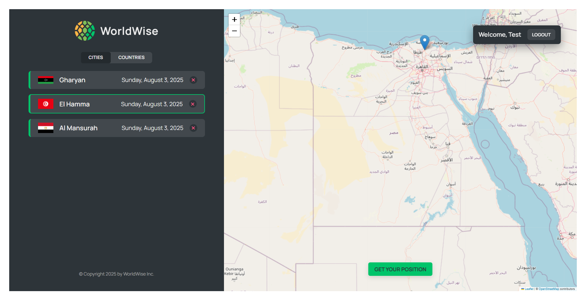
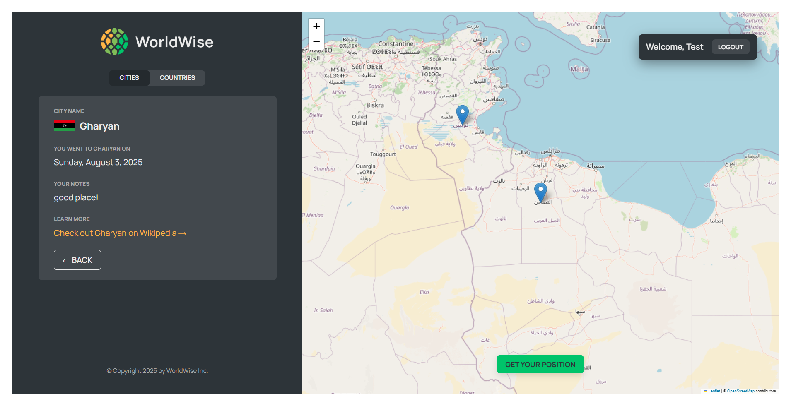
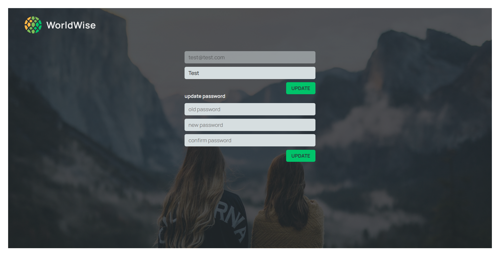

# 🌍 World Wise – Travel Map Notes App


**World Wise** is a full-stack React application that allows users to pin visited locations on an interactive map, attach personal notes, and revisit their travel experiences anytime. Built with Leaflet.js, Firebase, and React Router, this project emphasizes interactive map handling and real-time data synchronization.

## Features

- **Map Integration (Leaflet.js)**  
  Select any location on the interactive map to add a pin.

- **Travel Notes**  
  Attach notes and mark memories for each place you’ve visited.

- **Real-Time Sync with Firebase**  
  All notes are stored in Firestore and update instantly across sessions and devices.

- **Smart Filtering**  
  Filter saved places by **city** or **country**.

- **User Profile Management**

- Update your **username**
- Change your **password**

- **Authentication**  
  Secured login and registration with Firebase Authentication.

## Tech Stack

| Technology   | Usage                             |
| ------------ | --------------------------------- |
| React JS     | Frontend framework                |
| Firebase     | Auth & Firestore for real-time DB |
| Leaflet.js   | Map rendering and interaction     |
| React Router | Routing between pages             |

## Project Purpose

The primary goal of **World Wise** is to gain hands-on experience with interactive maps in a React environment, while exploring real-time applications using Firebase. It combines frontend logic, map APIs, and secure backend functionality into one cohesive application.

## Screenshots

#### Home


#### login



#### signup



#### cities



#### city



#### profile



## 🎥 Walkthrough Video

> ▶️ Watch the full walkthrough of **World Wise** on Vimeo:  
> **[Watch here](https://vimeo.com/1106915108?ts=0&share=copy)**

## 🛠️ Setup Instructions

1. **Clone the repository**

   ```bash
   git clone https://github.com/your-username/world-wise.git
   cd world-wise

   ```

2. **Install dependencies**

   ```bash
   npm install
   ```

3. **Firebase Setup**

   - Create a project on [Firebase Console](https://console.firebase.google.com/)
   - Enable **Authentication** (Email/Password)
   - Create a **Cloud Firestore** database
   - Get your Firebase config and replace it in `/firebase/config.js`

4. **Run the app**

   ```bash
   npm start
   ```

## Learning Highlights

- Mastered **Leaflet.js** for map integration in React.
- Implemented real-time syncing using **Firebase Firestore**.
- Managed secure **authentication and user data updates**.
- Applied modular component design and reusable **custom hooks**.
- Built responsive, interactive UI with React best practices.

## License

This project is licensed under the MIT License.
See the [LICENSE](./LICENSE) file for more details.

## Feedback & Contributions

Feel free to open issues or submit pull requests if you’d like to contribute or improve the app!
For suggestions or questions, please reach out via GitHub Issues.

Let me know if you’d like this exported as a `.md` file or want to include deployment instructions (like Vercel or Firebase Hosting), environment variables, or example Firebase structure!
